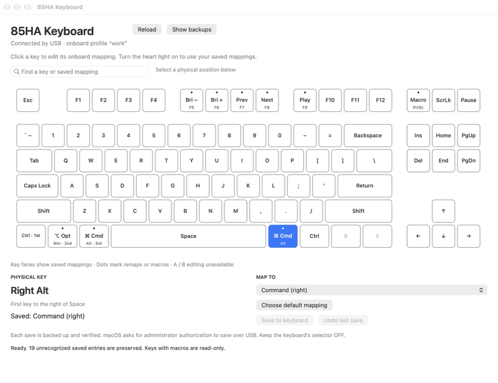
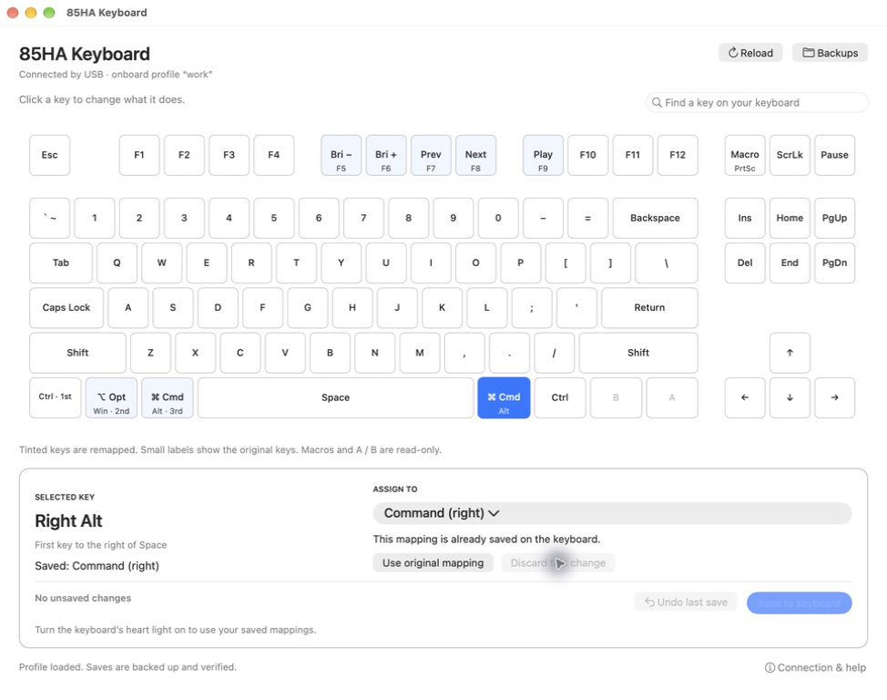
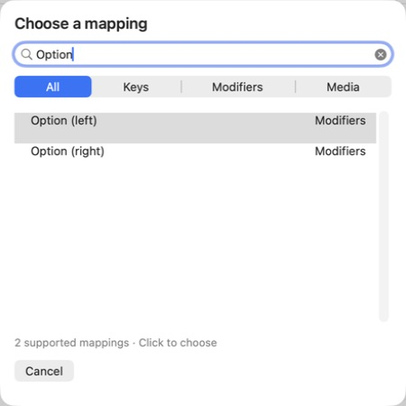
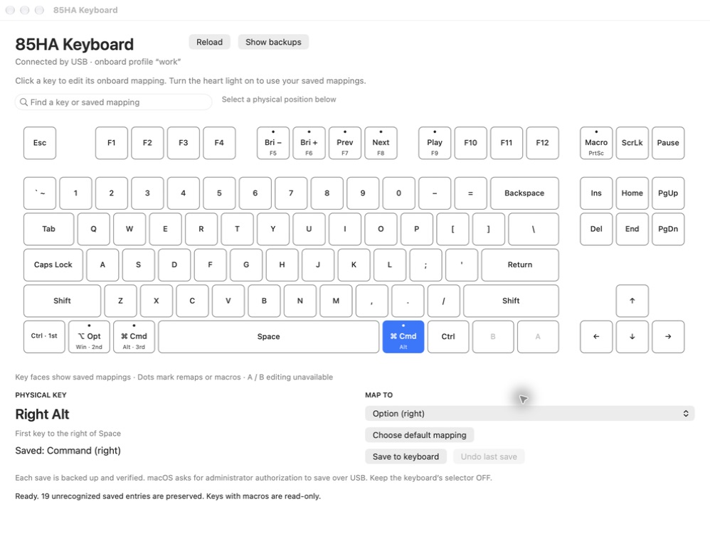
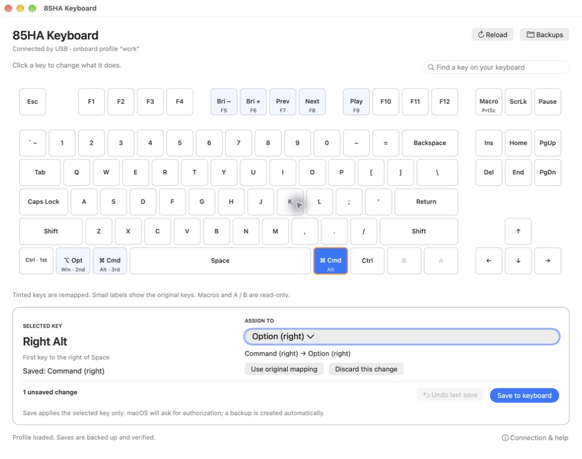

# 85HA editor: UI/UX audit and improvements

Scope: the native Mac app, from selecting a physical key to reviewing a proposed onboard mapping. Source: live app capture in this run and the user's supplied screenshot. Captures are unaltered; the capture tool scales the main window and captures the mapping sheet separately.

The keyboard diagram was a good foundation. The biggest problems were the long destination menu, weak feedback about pending changes, and repeated instructions competing with the task. The updated build keeps the physical layout and native controls, adds a searchable chooser, and groups editing and save controls.

## 1. Select a key — improved and verified

Before: repeated instructions, scattered controls, unexplained dots, and persistent diagnostics crowded the screen. The physical layout and saved key labels were useful.

After: compact header with trailing utilities, tinted remaps, stronger key outlines for selection, and a single editing panel. Full physical positions remain available for replaced modifier keycaps. Diagnostics are under Connection & help.

Accessibility: physical key names, saved mappings, selected state and pending state are exposed in accessibility labels/values. Small secondary key legends remain a contrast/readability risk; full names are repeated in the editor and tooltips. No screen-reader or formal contrast audit was performed.

## 2. Choose a mapping — improved and verified

Before: the accessibility tree exposed 108 destinations in a native menu with separators, without a search field or category names. The old menu could not be screenshotted in two capture attempts, so its visual appearance is not audited.

After: a native dialog supports search and All / Keys / Modifiers / Media categories. Searching Option returns only its two variants. No-match search shows an explicit message and cannot select a stale entry. Cancel makes closing without a choice clear.

Accessibility: standard search, segmented controls and table rows expose names through the accessibility tree. Search focus, mouse selection and empty-result handling were exercised. Full keyboard traversal and VoiceOver have not been audited.

## 3. Review the change — improved and verified

Before: choosing a different destination enabled Save, but there was no explicit unsaved summary.

After: old → new summary, an unsaved count, a pending outline, and a Discard action. Choices survive switching keys and reloading. Quit offers Keep editing or Discard and close. Save still applies one selected key at a time. Selecting a macro disables editing without losing another key's draft.

Accessibility: pending changes have textual feedback as well as a colored outline. Save's disabled/enabled state is exposed. Live announcements of state changes have not been verified.

## 4. Save and verify on hardware — not repeated in this audit

No hardware write was invoked during this UI pass. The administrator prompt, write result, error recovery and physical key output are outside this run's evidence. Earlier save/undo validation remains separately recorded in VALIDATION.json; it is not counted as current audit evidence.

## Delivery and limits

The standalone app was rebuilt and its signatures verified. Automated checks passed for geometry, destination filters, draft retention, no-match selection, macro protection, payload bounds, default normalization, collateral-change detection and shell quoting. Live interaction checks passed as described above. The staged Right Alt → Option test was discarded; the final screen has no unsaved changes and shows Right Alt saved as Command (right).

This is a scoped UX improvement, not a claim of full accessibility compliance. Dark appearance, alternate display sizes, complete keyboard-only navigation, VoiceOver, physical power cycling and hardware-save actions were not tested in this audit.
